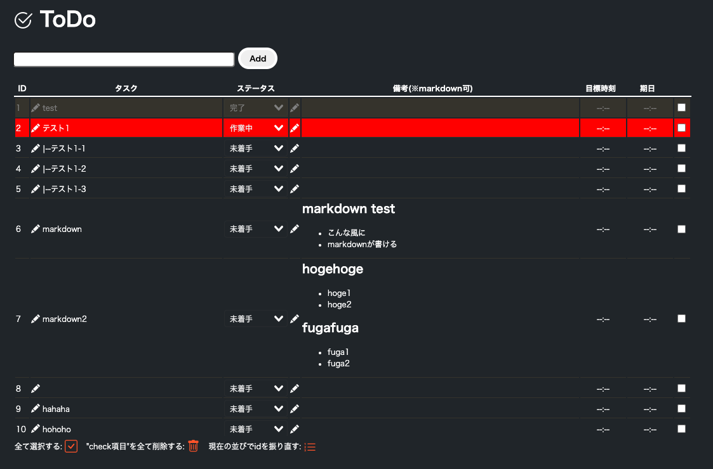

## 概要
Vue.jsで作ったToDoリスト。  
[このリンク](https://ukiuki-engineer.github.io/todo_vue/)から直接動かせる。  

## 設計思想？
その日一日のタスクを管理するためだけの使い捨てのtodoリスト。  
基本的にその日が終わったら使い捨てるような感じの使い方を想定しています。
なのでわざわざDBにデータを蓄積する必要がないので、バックエンドなしでフロントエンドのみの構成としています。
## 使い方
- [このリンク](https://ukiuki-engineer.github.io/todo_vue/)から直接動かせる。
- ネットに繋がっていない時でも使いたい場合
```git clone```するかディレクトリごとダウンロードし、index.htmlをブラウザで開くだけ。  

## 機能一覧
- タスク追加
- タスク編集
- チェックされたタスクの削除
- 全チェックボタン
- ステータス変更(セレクトボックス)
- ステータスを変更すると行の色が変わる
  - 作業中→赤
  - 完了→グレー
- 備考編集  
→markdown可
- ドラッグアンドドロップによる順序入れ替え
- ソート機能
- 目標時刻編集
- 期日編集
## 実装予定・検討中の機能
memo.mdを参照
